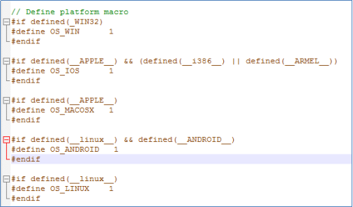
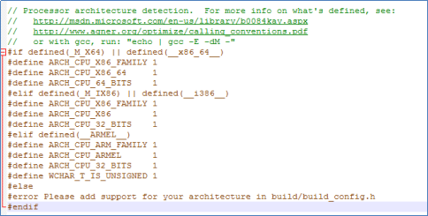
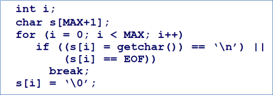

## C++跨平台
C++跨平台是指同一份代码可以不加修改的在不同的平台上编译运行且表现一致。
所谓不同的平台包括：
* 不同的操作系统
* 不同的CPU
* 不同的语言集
* etc.

## 平台移植性
从c++代码到程序最终运行需要经过下面步骤，每个步骤都需要考虑平台移植性：
* 编译
> 主要是代码的可移植性
* 链接
> 主要是第三方库的可移植性
* 运行
> 主要是系统运行时的可移植性

## 目标运行系统
一般我们需要支持的系统可能有：Windows、linux、iOS、Android。其中各个系统又有自己的不同版本，如Windows有win XP，vista，win7，win8，win10等，这些版本差异对于标准c++程序来说基本无关紧要。但是对于使用到系统API的程序，需要注意API的说明，包括是否废弃、是否兼容等。

## 目标CPU
一般我们需要支持的CPU可能有：X86，X86-64，arm，arm64。不同CPU可能有一些差异，如字长，大小端等。同时，如果需要用到CPU专用的指令，不同的CPU也有不同的指令集，如x86、x86-64系列的MMX、SSE指令，arm、arm64系列的Neon指令等。

## 编译器
常用编译器包括：gcc，clang，msvc等。编译器与目标系统并非绑定，可以通过交叉编译的方式编译其他平台的可执行程序。编译器在不同优化等级下，程序行为可能会不一致，如msvc在debug模式下会插入很多边界检测代码、申请的变量自动清零等（更多参考：Debug与Release版本的区别）。注意代码不能依赖优化等级。编译器对于c++标准的接口一致，内部实现可能各有千秋，如在4.9.0之前的gcc中定义了regex，但是并未实现。而对于未定义行为，不同编译器可能表现不一致，因此尽量避免未定义行为。

## 平台检测
有些情况下不得不使用非标准c++的时候，同样可以编写跨平台的代码。这时候需要定义统一的接口，然后在不同的平台下做不同的实现。
这时候就需要做平台检测，一般可通过系统或者编译器预定义的宏做检测。
* 操作系统检测  

* 编译器检测  

* CPU检测  

## c++标准
c++标准包括：C++ 98, c++03, c++11, c++14, c++17，中间还有若干修订版本。更多参考：[history of c++](http://www.cplusplus.com/info/history/)。
基本上c++03以及之前的标准（c++0x），目前大部分编译器版本都能支持。c++11以及之后的标准（c++1y），gcc4.8, vc++2013, clang++3.3以及之后的版本都在不同程度上支持c++1y。

## 异常处理
在使用c++异常处理时一般配合RAII ，以防止资源泄漏。c++异常不能处理类似内存访问越界、除零错误等底层错误。Android平台，NDK编译时可以选择是否启用c++异常。
除了标准c++中的异常之外，还有一些平台相关的异常，如windows下的结构化异常处理（SEH），这种异常处理功能比较强大，能捕捉更多的异常，但是并不通用，写跨平台代码时候尽量少用。

## 换行
在windows中换行是”\r\n”，而在xnix环境中换行是”\n”，mac中换行是”\r”。在处理文本文件的时候需要注意换行的问题。

## 路径分隔符
在windows中路径分隔符是”\”，而在xnix环境中换行是”/”。在处理路径的时候需要注意分隔符的问题。

## 数据对齐
结构体在不同的平台下对齐方式可能不一致，因此除非在结构体前后声明：
#pragma pack(push,1)
#pragma pack(pop)

否则，不推荐声明一个结构体变量，然后直接从文件中map到结构体这种方式来读取。

## 数据类型
c++标准中只规定了数据类型的最小bits，在不同系统/CPU/编译器环境下bit位数可能不一样。
如：
int：规定最少为16bit，16位机器上是16bit，32位&64位机器一般实现为32bit。
long：在windows msvc下，32位&64位系统都为32bit，而在linux gcc 64位系统下为64bit。
wchar_t：在windows msvc下是16bit，而在linux下是32bit。
char：char是否为signed并不是固定的，在部分平台下char是unsigned char，如Android 64bit系统。
size_t：size_t不同平台具有不同大小。

## char signed or unsigned ?
下面的代码可能会出问题。其中，MAX=10, EOF=-1。

## 数据类型
目前c++中可以使用<cstdint>中定义的数据类型，包括：uint8_t，int8_t，uint32_t，int32_t等，这些数据类型在不同平台和编译器下均保持一致。在定义数据结构或者二进制文件时，使用<cstdint>中的数据类型可减少数据类型不一致的问题。
此外，不要使用平台自定义的数据类型，如windows SDK下定义了很多数据类型：FLOAT，LONG，CHAR，DWORD，LONG_PTR，INT_PTR等。

## 字符编码
目前常接触到的字符编码包括：ANSI（中文系统下即为gbk/gb2312等）、UTF-8、UTF-16。
windows下默认使用ANSI，其他系统下默认使用UTF-8。
在定义二进制文件时一般采用UTF-16，因为UTF-16是定长编码（UCS-2编码每个字符16bit，UCS-4编码时每个字符32bit，一般使用UCS-2），比较方便处理。

## 函数符号
函数符号是指编译器标记函数的一种助记符，用做目标文件的链接。
一般在实际工程中，以下几点：
* 跨语言调用
> 跨语言调用是指类似python，php调用c/c++实现的功能（一般很少反向调用）。跨语言调用一般通过导出c风格的函数，或者通过类似boost.python。推荐前一种方式。
* 隐藏实现细节
> 文件内函数&变量使用static前缀
gcc/clang设置CFLAGS = -ffunction-sections -fdata-sections -fvisibility=hidden LDFLAGS += -Wl,--gc-sections，需要导出的函数添加前缀：__attribute__((visibility("default")))
msvc在导出函数之前添加前缀：__declspec(dllexport)

## 内存管理
在导出接口时，内存管理遵循谁申请谁释放的原则，一般提供接口来释放内存。
不要在跨模块调用时直接调用free或者delete释放，这很可能在部分平台下发生crash。

## 第三方库
* 可移植性
程序当中有时候需要一些额外的第三方库，如Json解析等。在选择第三方库的时候，也需要注意可移植性问题，一般在项目说明或者Issue中会有是否具备可移植性的解释。
* 轻量
第三方库一般建议选择轻量级的库，编译和修改都会比较方便。

***

c++由于相对比较底层，因此跨平台开发比较考验对体系结构、编译器、C++语法的理解，多踩坑才能多进步。